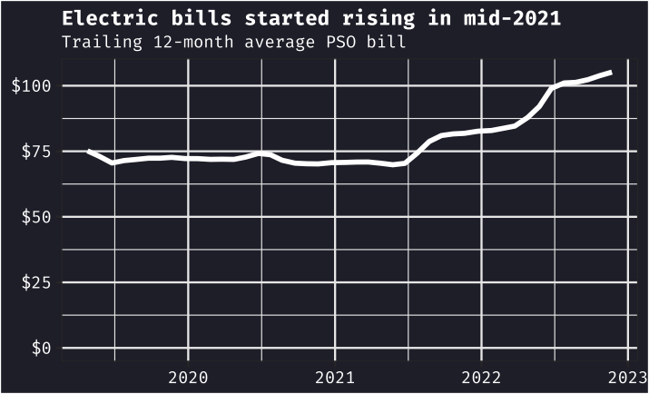
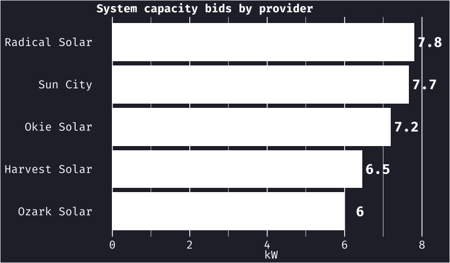
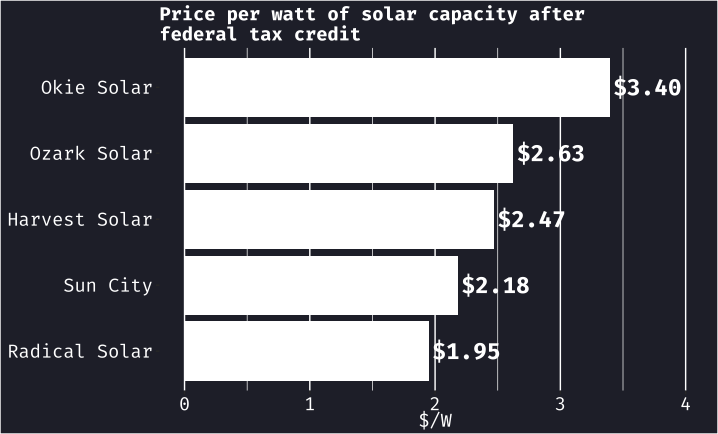
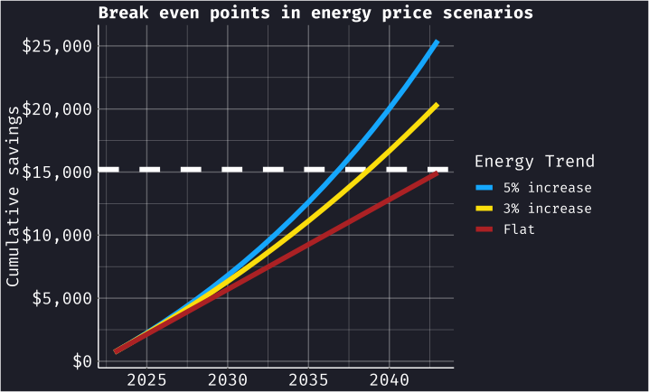

Becoming a parent has changed me in a lot of ways, one of which has been to turn my tendency to catastrophize into a more productive, defiant desire to be more self-reliant, trying to see climate disasters as a challenge to confront rather than a fate to be dreaded.

The [2021 cold snap](https://www.weather.gov/ict/historicCold) was one of the scarier manifestations of our changing climate in Oklahoma. Though we didn't experience the widespread power outages that many parts of Texas did, our natural gas-powered grid [strained under the pressure](https://www.eia.gov/todayinenergy/detail.php?id=50778) of the subzero temperatures and led to the [largest electric rate increases](https://www.koco.com/article/oklahoma-electric-bills-largest-increase/41065295) in the nation in 2022. In mid-2021, our electric bills started climbing for the first time since we moved into our house in 2016. They're now over \$25 per month (33%) higher, with all of that increase coming in the last year and a half:  That trend has continued, with our provider Public Service Company of Oklahoma (PSO) seeking another [rate increase](https://tulsaworld.com/news/local/pso-seeks-another-electricity-rate-increase/article_c8029736-6aa9-11ed-aea8-573e0830163c.html) in November 2022 and another bone-chilling cold snap pushing temperatures below zero around Christmas 2022. I can't find any good reason to believe that the weather will calm down or oil-drenched Oklahoma will swerve away from fossil fuels before we are painfully, reluctantly forced to do so.

# Solar has gotten more practical

The passage of the [Inflation Reduction Act](https://pv-magazine-usa.com/2022/11/14/the-role-of-solar-in-the-inflation-reduction-act/) begat rippling news cycles of [how cheap solar power has gotten](https://arstechnica.com/science/2022/06/solar-and-wind-keep-getting-cheaper-as-the-field-becomes-smarter/), and I started looking into getting solar panels for our house. Up to that point, I had gathered that grid energy is too cheap in Oklahoma for home solar to be practical, but with the instability of fossil fuel prices and the climate becoming ever more volatile, that might not be the case much longer.

After poking around on the many referral websites that dominate the Google search results for "solar power oklahoma", I got bids from five different companies. They reviewed my power bills and used my home address to model the sunlight available on our roof (using tools similar to [this one](https://pvwatts.nrel.gov/)), and proposed systems with capacity ranging from 6 to 7.8 kilowatts.

The range of sizes proposed by each company is interesting, with the biggest being about 30% more powerful than the smallest system. The more revealing comparison, though, was the price per watt after the 30% federal tax credit. [Radical Solar](https://radicalsolarenergy.com/) was easily the winner on that front; their bid was the largest system and the lowest overall price, with a cost of less than \$2 per watt:  We took the plunge and signed a contract with Radical Solar in November 2022, and our panels were installed in late December. We're currently waiting for inspections by the City and by PSO before they're flipped on and start harvesting.

# Going solar in Oklahoma is a bet on rising energy prices

Home solar has long made financial sense in places like [California](https://www.energysage.com/solar-panels/ca/), where energy bill savings often surpass the cost of installation within 6-8 years. In Oklahoma, lower energy prices mean the payoff period is much longer. Oklahoma's [net energy metering](https://oklahoma.gov/occ/divisions/public-utility/electric-utility/netmetering.html) policy will credit us for the power we send to the grid when our panels produce more than our house consumes, but our energy bills won't go below the cost of service to our house, about \$20 per month.

With this policy, Radical Solar estimates that our panels will save us about \$700 in 2023, coming mainly in the summer months when our air conditioner is fighting the miserable Oklahoma heat. Assuming an average 3% increase in energy prices and stable energy consumption, Radical Solar estimates we would break even in about 16 years. 

As the chart shows, if prices rise faster, the panels could pay for themselves sooner - 14 years at a yearly 5% increase. Even if prices remain the same over the lifetime of the panels - 21 years - they will end up being a wash financially.

# The sooner the better

The financial case for solar panels in Oklahoma is sound, but it's not nearly as clear a winner as it is in states with more solar-friendly policies and higher energy prices. But it feels like a good bet that electricity is going to be less rather than more reliable, and more rather than less costly, in the medium- to long-term. 
